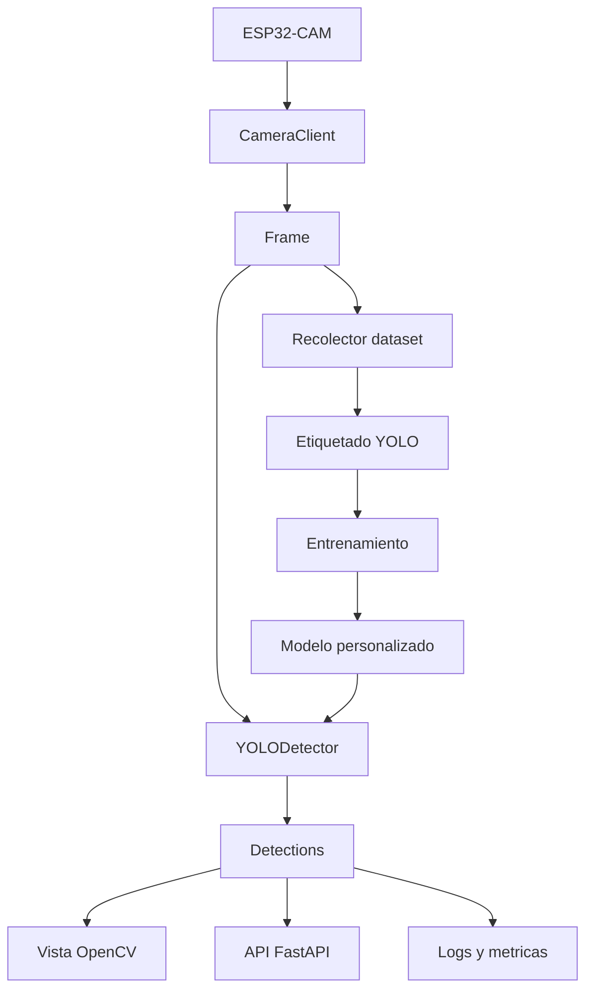

# Proyecto ESP32-CAM + YOLO para carros de juguete

Este proyecto convierte la ESP32-CAM en una fuente de video para detectar carros de juguete con YOLO. Incluye captura de imagenes, deteccion en vivo, API local, preparacion de dataset y entrenamiento.

## 1. Instalar dependencias

Usa Python 3.13 si ya lo tienes activo, aunque para PyTorch/Ultralytics suele ser mas estable Python 3.11 o 3.12.

```powershell
cd "C:\Users\EDISON\OneDrive\Email attachments from Flow\Documentos\UNIVERSITA\PROGRAMACION\PROJECT"
python -m venv .venv
.\.venv\Scripts\Activate.ps1
python -m pip install --upgrade pip
pip install -r requirements.txt
```

Si `ultralytics` falla con Python 3.13, instala Python 3.11/3.12 y crea el entorno con esa version.

## 2. Probar la camara

Edita `configs/settings.yaml` si cambia la IP de la ESP32-CAM. Para muchas ESP32-CAM el stream funciona mejor con `/stream`:

```yaml
camera_url: "http://192.168.1.44/stream"
```

Prueba la conexion:

```powershell
python scripts/check_camera.py
```

## 3. Deteccion en vivo

Primero usa el modelo base `yolo11n.pt` para validar que el flujo funciona:

```powershell
python MAIN.PY
```

Para el sistema completo:

```powershell
python scripts/live_detect.py
```

Controles:

- `q`: salir
- `s`: guardar frame en `data/raw`

## 4. Recolectar imagenes para entrenar carros de juguete

```powershell
python scripts/capture_dataset.py --seconds 120 --every 1.0
```

Toma fotos con distintos fondos, luces, angulos y distancias. Para un primer modelo util, apunta a 200-500 imagenes. Para algo robusto, 1000+.

## 5. Etiquetar imagenes

Usa una herramienta como LabelImg, Roboflow, CVAT o makesense.ai y exporta en formato YOLO. La clase principal queda:

```text
0 toy_car
```

La estructura esperada es:

```text
data/images/train
data/images/val
data/labels/train
data/labels/val
```

Cada imagen debe tener un `.txt` con el mismo nombre en `labels`, con lineas YOLO:

```text
class x_center y_center width height
```

## 6. Entrenar YOLO

```powershell
python scripts/train_yolo.py --epochs 80 --imgsz 640 --model yolo11n.pt
```

El mejor modelo suele quedar en:

```text
runs/detect/toy_car_detector/weights/best.pt
```

Copia ese archivo a `models/toy_car_best.pt` o cambia `model_path` en `configs/settings.yaml`.

## 7. API local

```powershell
uvicorn src.esp32_yolo.api:app --reload --host 0.0.0.0 --port 8000
```

Endpoints:

- `GET /health`: estado del sistema
- `GET /snapshot`: captura una imagen de la ESP32-CAM
- `POST /detect`: sube una imagen y devuelve detecciones
- `GET /detect/live`: toma un frame de la ESP32-CAM y devuelve detecciones

## 8. Arbol funcional del proyecto



## 9. Flujo 3D sugerido para pruebas

Para que el sistema aprenda bien carros de juguete, captura datos variando tres ejes:

- Escena: mesa, piso, pista, fondo oscuro, fondo claro.
- Camara: cerca/lejos, arriba/lateral, inclinada/frontal.
- Objeto: colores, tamanos, parcialmente tapado, varios carros juntos.

La combinacion de esos tres ejes funciona como un arbol tridimensional de pruebas: cada rama produce imagenes distintas y evita que el modelo solo aprenda un unico escenario.

## 10. Dashboard web con SUMO

Copia tu archivo SUMO en la carpeta `sumo/`. El proyecto intentara leer `OSM.net.xml`, `osm.net.xml`, cualquier `*.net.xml` o un archivo con `ntxml` en el nombre.

Luego ejecuta:

```powershell
uvicorn src.esp32_yolo.api:app --reload --host 0.0.0.0 --port 8000
```

Abre en el navegador:

```text
http://127.0.0.1:8000
```

El tablero muestra:

- Imagen de la ESP32-CAM.
- Detecciones YOLO en vivo.
- Mapa de carretera desde SUMO.
- Vehiculos simulados visualmente sobre la red.
- Estado del modelo, red y conteos.

La simulacion web inicial es visual. La siguiente etapa seria conectar SUMO real con TraCI para leer vehiculos reales de la simulacion y despues enviar decisiones de semaforo.

## 11. Semaforo inteligente

La configuracion esta en `configs/traffic_lights.yaml`. El controlador calcula una decision simple:

- Cuenta carros por zona de camara.
- Calcula demanda por carril.
- Asigna mas tiempo verde al carril con mayor demanda.

Endpoints utiles:

- `GET /api/status`: estado general, red SUMO, simulacion y decision.
- `GET /api/simulation/step`: avanza la simulacion interna.
- `POST /api/simulation/reset`: reinicia la simulacion interna.

Cuando quieras conectar SUMO real, la siguiente etapa es usar TraCI para reemplazar `SimpleTrafficSimulation` por datos reales de SUMO.

## 12. Entrenar con los carritos de juguete

La guia especifica esta en `docs/dataset_toy_cars.md`. El primer modelo personalizado usa una sola clase: `toy_car`.

Flujo recomendado:

```powershell
python scripts/capture_dataset.py --seconds 180 --every 1.0
```

Luego etiqueta las imagenes en formato YOLO, divide en `train/val` y entrena:

```powershell
python scripts/train_yolo.py --epochs 80 --imgsz 640 --model yolo11n.pt
```

Si todavia no tienes el modelo base, descargalo primero:

```powershell
python scripts/download_model.py --model yolo11n.pt
```

## 13. Grafos, SUMO y matematicas discretas

La explicacion de grafos esta en:

```text
docs/matematicas_discretas_grafos.md
```

El SUMO usado por el dashboard es el mapa simple:

```text
sumo/sample_intersection.net.xml
```

El archivo `map.zip` no se usa para esta entrega.

## 14. Camaras

El proyecto puede usar ESP32-CAM o webcam del computador.

Archivos rapidos:

- `CAMARA_AUTO.bat`: recomendado, ESP32 primero y webcam como respaldo.
- `CAMARA_ESP32.bat`: solo ESP32.
- `CAMARA_WEBCAM.bat`: solo webcam.

La guia esta en:

```text
docs/camaras.md
```


