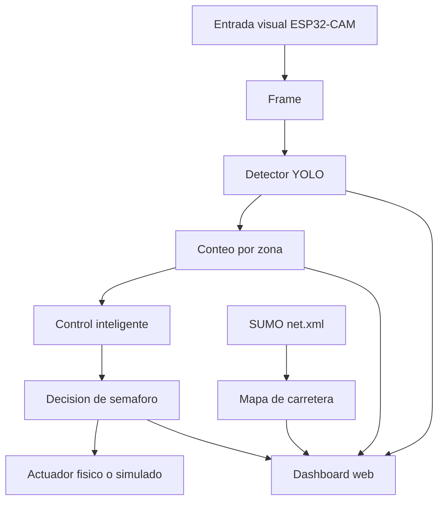

# Arquitectura del proyecto Smart Traffic Lab

## Objetivo

Construir un sistema de semaforos inteligentes por etapas:

1. La ESP32-CAM captura la escena.
2. YOLO identifica carros de juguete.
3. La API entrega conteos y detecciones.
4. SUMO representa o simula la carretera.
5. El dashboard web muestra camara, detecciones, red vial y estado del sistema.
6. Las reglas de decision cambian tiempos de semaforo segun flujo vehicular.

## Arbol funcional

## Arbol tridimensional de pruebas

Eje X: vision por camara

- Luz alta, media, baja.
- Fondo claro, oscuro, con objetos.
- Camara frontal, lateral, superior.

Eje Y: trafico

- Un carro.
- Varios carros.
- Carros detenidos.
- Carros en movimiento.

Eje Z: decision

- Semaforo fijo.
- Semaforo por conteo.
- Semaforo por prioridad.
- Semaforo simulado en SUMO.

La meta no es hacer todo perfecto al inicio. La meta es que cada eje pueda crecer sin romper los demas.
