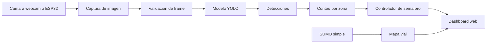
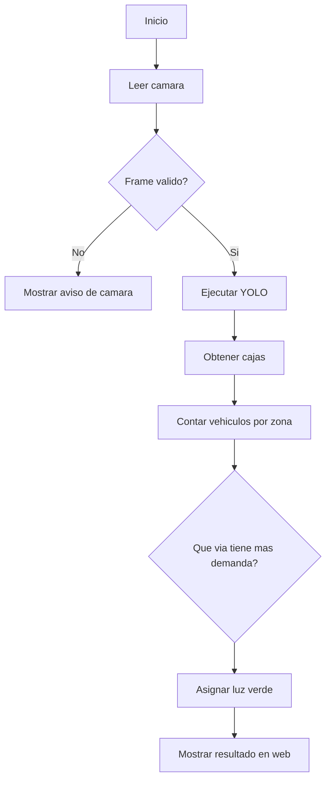

# Informe base del proyecto

## 1. Portada

**Universidad:** Universidad Industrial de Santander  
**Escuela:** Escuela de Ingenieria de Sistemas e Informatica  
**Programa:** Ingenieria en Inteligencia Artificial  
**Asignatura:** Algoritmos y Programacion  
**Titulo:** Smart Traffic Lab: sistema computacional para deteccion de carritos y apoyo a semaforos inteligentes  
**Integrantes:** completar nombres  
**Profesor:** completar nombre  
**Fecha:** completar fecha de entrega  

## 2. Introduccion

El proyecto desarrolla una solucion computacional introductoria para apoyar el analisis de semaforos inteligentes. El sistema integra una camara, deteccion con YOLO, una pagina web de visualizacion y una simulacion vial sencilla basada en SUMO.

El problema es importante porque el trafico puede entenderse como un flujo de vehiculos que debe ser observado, contado y usado para tomar decisiones. En este proyecto se trabaja a escala de laboratorio con carritos de juguete, lo que permite probar conceptos de vision por computador, grafos, simulacion y logica de programacion sin depender de una via real.

La programacion cumple el papel central de conectar los modulos: captura de imagenes, procesamiento, conteo, decision, simulacion y presentacion de resultados.

## 3. Planteamiento del problema

Se busca construir un programa que permita observar una escena mediante camara, detectar vehiculos de juguete, contar posibles carros presentes y mostrar una decision basica de semaforo en una interfaz web.

**Problematica central:** contar vehiculos y apoyar una decision de semaforo de forma automatizada.  
**Datos necesarios:** imagenes de camara, red vial SUMO, configuracion de semaforos y modelo YOLO.  
**Resultado esperado:** dashboard con camara, detecciones, simulacion SUMO y decision de semaforo.  
**Restricciones:** la deteccion final de carritos requiere entrenamiento; la camara puede fallar; el modelo base YOLO no reconoce perfectamente carritos de juguete.

## 4. Objetivos

### Objetivo general

Desarrollar una solucion algorítmica en Python para detectar y contar vehiculos de juguete mediante camara, integrando una interfaz web y una simulacion vial simple que apoye la toma de decisiones de un semaforo inteligente.

### Objetivos especificos

- Analizar las entradas, procesos y salidas del sistema.
- Disenar una arquitectura modular para camara, deteccion, simulacion, API y dashboard.
- Implementar funciones para captura de imagen, deteccion YOLO, conteo y decision de semaforo.
- Integrar una simulacion SUMO sencilla como grafo vial.
- Validar el funcionamiento con casos de prueba basicos y casos de error.
- Documentar el algoritmo, la logica de programacion y las limitaciones del sistema.

## 5. Analisis del problema

| Elemento | Descripcion tecnica |
| --- | --- |
| Entradas | Imagen de webcam o ESP32-CAM, modelo YOLO, red SUMO, configuracion YAML |
| Procesos | Captura de frame, deteccion, conteo por zona, calculo de demanda, seleccion de luz verde |
| Salidas | Video en dashboard, numero de detecciones, estado de SUMO, decision de semaforo |
| Variables clave | `camera_source`, `frame`, `detections`, `counts`, `green_lane`, `green_seconds` |
| Restricciones | Camara disponible, modelo YOLO existente, dataset etiquetado para deteccion personalizada |

## 6. Diseno del algoritmo

### Diagrama de bloques funcionales



### Diagrama de flujo de decision



### Division modular

- `camera.py`: manejo de webcam y ESP32-CAM.
- `detector.py`: carga y ejecucion de YOLO.
- `traffic_controller.py`: conteo y decision de semaforo.
- `sumo_network.py`: lectura de red SUMO simple.
- `api.py`: endpoints web y puente entre modulos.
- `web/`: interfaz visual del dashboard.
- `scripts/`: ejecucion, entrenamiento y pruebas.

## 7. Implementacion del programa

El proyecto fue implementado en Python usando:

- FastAPI para el backend.
- OpenCV para camaras.
- Ultralytics YOLO para deteccion.
- HTML, CSS y JavaScript para el dashboard.
- SUMO `.net.xml` simple para representar el grafo vial.

El dashboard se ejecuta con:

```powershell
python scripts\run_dashboard.py
```

La pagina se abre en:

```text
http://127.0.0.1:8000
```

## 8. Explicacion de la logica de programacion

### Ciclos

Se usa `while` o generadores para mantener la lectura de camara en vivo. Esto permite recibir frames continuamente mientras el programa esta activo.

### Condicionales

Los condicionales se usan para:

- elegir camara (`webcam`, `esp32`, `auto`),
- validar si el frame existe,
- decidir si se usa YOLO o se muestra un mensaje de error,
- seleccionar el carril con mayor demanda.

### Funciones

El problema se divide en funciones pequenas:

- abrir camara,
- leer frame,
- ejecutar deteccion,
- contar vehiculos,
- decidir semaforo,
- dibujar o enviar datos al dashboard.

### Estructuras de datos

Se usan listas y diccionarios para representar:

- detecciones,
- carriles,
- nodos y aristas de SUMO,
- conteos por direccion,
- estado de la camara y del modelo.

## 9. Pruebas de funcionamiento

| ID | Caso de prueba | Resultado esperado | Estado |
| --- | --- | --- | --- |
| 01 | Abrir dashboard | La pagina carga en `127.0.0.1:8000` | Pendiente de captura final |
| 02 | Cambiar a webcam | Se intenta abrir camara del computador | Depende de permisos Windows |
| 03 | Cambiar a ESP32 | Se abre la web/captura de `192.168.1.44` | Depende de conexion WiFi |
| 04 | Sin camara disponible | Se muestra imagen de aviso, no colapsa | Implementado |
| 05 | Leer SUMO simple | Se dibuja interseccion simple | Implementado |
| 06 | YOLO base | Carga `yolo11n.pt` | Implementado |
| 07 | YOLO personalizado | Usa `models/toy_car_best.pt` | Pendiente de entrenamiento |

## 10. Resultados y analisis

El sistema ya integra los modulos principales: dashboard, API, camaras configurables, SUMO simple y modelo YOLO base. La limitacion principal es que el reconocimiento especifico de carritos de juguete requiere entrenar un modelo personalizado con imagenes etiquetadas.

El modelo base puede detectar objetos generales, pero no garantiza reconocer carritos pequenos, empaques plasticos o escenarios de laboratorio. Por eso el siguiente paso tecnico es construir el dataset.

## 11. Aplicacion de inteligencia artificial

La IA se usa en nivel introductorio mediante un modelo YOLO preentrenado. El proyecto no pretende disenar una red neuronal desde cero. La aplicacion consiste en:

1. usar YOLO base para pruebas iniciales,
2. capturar imagenes de carritos,
3. etiquetar cada carrito como `toy_car`,
4. entrenar un modelo personalizado,
5. usar `models/toy_car_best.pt` en el dashboard.

## 12. Conclusiones

El proyecto permite aplicar pensamiento algoritmico a un problema de observacion y decision. Se integran variables, condicionales, ciclos, funciones, listas, diccionarios, archivos de configuracion y una interfaz web.

La simulacion vial se entiende como un grafo, donde las intersecciones son nodos y las calles son aristas. La deteccion de vehiculos puede alimentar pesos de congestion para tomar decisiones de semaforo.

## 13. Referencias

- Documentacion oficial de Python.
- Documentacion oficial de FastAPI.
- Documentacion oficial de OpenCV.
- Documentacion oficial de Ultralytics YOLO.
- Documentacion oficial de SUMO.
- Guia del proyecto final de Algoritmos y Programacion entregada por el profesor.

