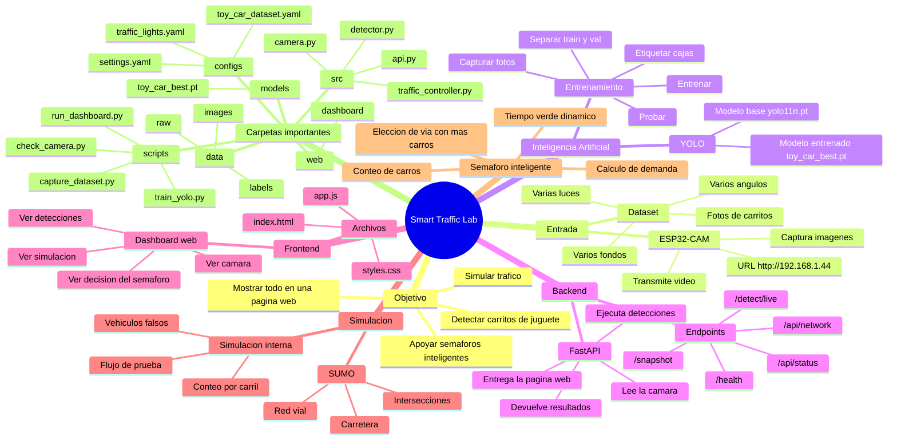
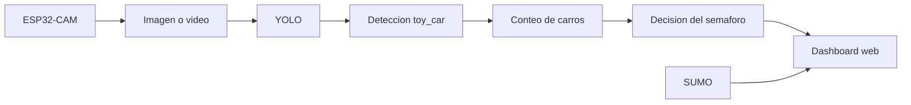
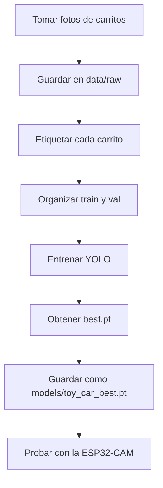

# Mapa mental del diseño del programa

Este mapa mental explica como esta organizado el proyecto de semaforos inteligentes con ESP32-CAM, YOLO, dashboard web y simulacion.

## Explicacion sencilla

El proyecto funciona como un cuerpo:

- La **ESP32-CAM** son los ojos.
- **YOLO** es el cerebro que reconoce los carritos.
- **FastAPI** es el mensajero que conecta la camara, la IA y la pagina web.
- El **dashboard web** es la pantalla donde vemos lo que esta pasando.
- **SUMO** es una ciudad simulada para probar trafico y semaforos.
- El **controlador de semaforo** decide que via debe tener mas tiempo en verde.

## Flujo principal

## Flujo para entrenar la IA

