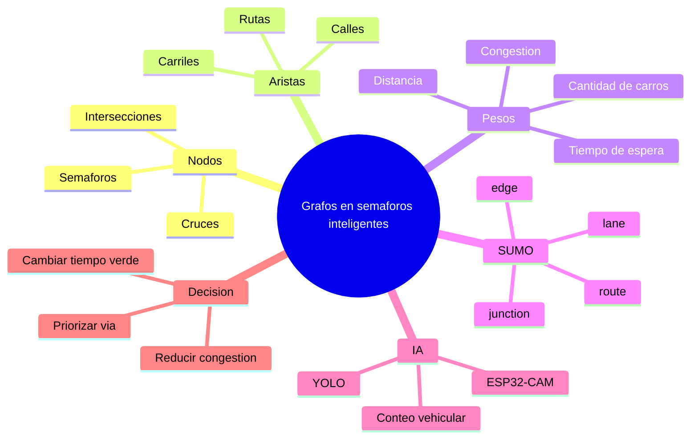

# Grafos y matematicas discretas en el proyecto

Este proyecto tambien se puede explicar desde matematicas discretas porque una ciudad o carretera puede verse como un **grafo**.

## Idea principal

Un grafo tiene:

- **Vertices o nodos**: puntos importantes del camino.
- **Aristas**: calles o conexiones entre puntos.
- **Pesos**: distancia, tiempo, cantidad de carros o congestion.

En este proyecto:

| Concepto de grafos | En el proyecto |
| --- | --- |
| Nodo | Interseccion, esquina, semaforo o punto de la via |
| Arista | Calle o tramo de carretera |
| Peso | Distancia, velocidad, flujo vehicular o tiempo de espera |
| Camino | Ruta que sigue un carro |
| Grado de un nodo | Cantidad de calles que llegan a una interseccion |
| Grafo dirigido | Calles con sentido unico |
| Grafo ponderado | Calles con costo o tiempo |

## Como se conecta con SUMO

SUMO representa la carretera como una red:

```text
barranca.net.xml
```

Ese archivo contiene:

- `junction`: nodos o intersecciones.
- `edge`: calles o aristas.
- `lane`: carriles.
- `speed`: velocidad permitida.
- `length`: longitud de la via.

Por eso, la red de SUMO es un grafo vial.

## Como se conecta con semaforos inteligentes

El semaforo inteligente toma decisiones usando informacion del grafo:

1. Mira cuantos carros hay en cada via.
2. Calcula donde hay mas demanda.
3. Decide cual arista o direccion debe tener luz verde.
4. Reduce espera y congestion.

## Como se conecta con la IA

La ESP32-CAM y YOLO ayudan a alimentar el grafo con datos reales:

```text
Camara -> Detecta carritos -> Cuenta vehiculos -> Actualiza peso de la via
```

Ejemplo:

Si una calle tiene muchos carritos, esa arista puede tener mayor peso de congestion.

```text
Arista A = 2 carros
Arista B = 9 carros
```

Entonces el semaforo puede dar prioridad a la arista B.

## Algoritmos que se pueden mencionar

- BFS: recorrer la red por niveles.
- DFS: explorar caminos.
- Dijkstra: encontrar ruta con menor costo.
- Grafos dirigidos: representar calles de una sola via.
- Grafos ponderados: representar distancia, espera o congestion.
- Matriz de adyacencia: tabla que indica conexiones entre nodos.
- Lista de adyacencia: forma eficiente de guardar calles conectadas.

## Mapa mental de grafos



## Documentos relacionados en la carpeta

Estos archivos tambien pertenecen al material de entrega:

- `Demo - main (3).pdf`
- `ia.pdf`
- `Untitled3 (3).ipynb`
- `SEMAFOROS.pdf`
- `DescripciónProyectoProgramacion_AlgoritmosIA2026-1.pdf`

